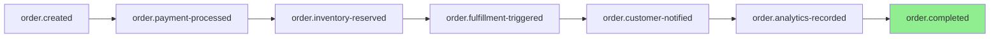

# Event Pipelines - Advanced Event-Driven Architecture

**Coordinated event chains for complex workflows**

**Last Updated**: October 21, 2025  
**Status**: Design Proposal

---

## 🎯 The Problem

Complex business operations often require **multiple updates across different features**:

**Example**: User creates an order
1. ✅ Create order record (Orders feature)
2. ✅ Reduce inventory (Inventory feature)
3. ✅ Update customer stats (Customers feature)
4. ✅ Send confirmation email (Email feature)
5. ✅ Trigger fulfillment (Warehouse feature)
6. ✅ Update analytics (Reports feature)

**Current Approach** (Coupled):
```csharp
public async Task CreateOrderAsync(CreateOrderDto dto)
{
    var order = await _orderRepository.InsertAsync(new Order(...));
    await _inventoryService.ReduceStockAsync(dto.Items);
    await _customerService.UpdateStatsAsync(order.CustomerId);
    await _emailService.SendAsync(...);
    await _warehouseService.TriggerFulfillmentAsync(order.Id);
    await _analyticsService.RecordOrderAsync(order);
}
```

**Problems**:
- ❌ Tight coupling (OrderService knows about 5 other services)
- ❌ Hard to test
- ❌ Hard to add new steps
- ❌ No way to disable steps
- ❌ Synchronous (slow)
- ❌ No error recovery

---

## 💡 The Solution: Event Pipelines

**Event Pipeline** = Declarative chain of events that trigger automatically

```
┌─────────────┐
│ User Action │
└──────┬──────┘
       │
       ▼
 ┌───────────┐      ┌──────────────┐      ┌─────────────┐
 │  Event 1  │─────>│   Event 2    │─────>│   Event 3   │
 └───────────┘      └──────────────┘      └─────────────┘
       │                    │                     │
       │                    │                     │
       ▼                    ▼                     ▼
  Handler A            Handler B             Handler C
  Handler D            Handler E             Handler F
                       Handler G
```

---

## 🏗️ Architecture

### 1. Event Definitions

```csharp
// NetMX.Events/DomainEvents.cs
public static class DomainEvents
{
    public static class Order
    {
        // Primary event
        public const string Created = "order.created";
        
        // Pipeline events (triggered by handlers)
        public const string PaymentProcessed = "order.payment-processed";
        public const string InventoryReserved = "order.inventory-reserved";
        public const string FulfillmentTriggered = "order.fulfillment-triggered";
        public const string CustomerNotified = "order.customer-notified";
        public const string AnalyticsRecorded = "order.analytics-recorded";
        
        // Terminal events
        public const string Completed = "order.completed";
        public const string Failed = "order.failed";
    }
}
```

### 2. Event Pipeline Configuration

```csharp
// Program.cs or Module configuration
services.AddEventPipeline(pipeline =>
{
    // Define pipeline for "order.created"
    pipeline.For(DomainEvents.Order.Created)
        .ThenTrigger(DomainEvents.Order.PaymentProcessed)
        .ThenTrigger(DomainEvents.Order.InventoryReserved)
        .ThenTrigger(DomainEvents.Order.FulfillmentTriggered)
        .ThenTrigger(DomainEvents.Order.CustomerNotified)
        .ThenTrigger(DomainEvents.Order.AnalyticsRecorded)
        .Finally(DomainEvents.Order.Completed)
        .OnError(DomainEvents.Order.Failed);
});
```

### 3. Event Handlers (Decoupled)

```csharp
// Payment Module
public class ProcessPaymentHandler : IEventHandler<OrderCreatedEvent>
{
    public async Task HandleAsync(OrderCreatedEvent @event, EventContext context)
    {
        // Process payment
        var payment = await _paymentService.ChargeAsync(@event.OrderId);
        
        // Emit next event with data
        await context.TriggerAsync(DomainEvents.Order.PaymentProcessed, new
        {
            OrderId = @event.OrderId,
            PaymentId = payment.Id,
            Amount = payment.Amount
        });
    }
}

// Inventory Module
public class ReserveInventoryHandler : IEventHandler<OrderPaymentProcessedEvent>
{
    public async Task HandleAsync(OrderPaymentProcessedEvent @event, EventContext context)
    {
        // Reserve inventory
        await _inventoryService.ReserveAsync(@event.OrderId);
        
        // Emit next event
        await context.TriggerAsync(DomainEvents.Order.InventoryReserved, new
        {
            OrderId = @event.OrderId
        });
    }
}

// Warehouse Module
public class TriggerFulfillmentHandler : IEventHandler<OrderInventoryReservedEvent>
{
    public async Task HandleAsync(OrderInventoryReservedEvent @event, EventContext context)
    {
        // Trigger fulfillment
        await _warehouseService.CreatePickListAsync(@event.OrderId);
        
        // Emit next event
        await context.TriggerAsync(DomainEvents.Order.FulfillmentTriggered, new
        {
            OrderId = @event.OrderId
        });
    }
}
```

### 4. Simplified Controller

```csharp
// OrderController (knows nothing about the pipeline)
[HttpPost]
public async Task<IActionResult> Create(CreateOrderDto dto)
{
    // Just create the order
    var order = await _orderService.CreateAsync(dto);
    
    // Trigger the pipeline (everything else happens automatically)
    await _eventBus.PublishAsync(DomainEvents.Order.Created, new
    {
        OrderId = order.Id,
        CustomerId = order.CustomerId,
        Items = order.Items,
        Total = order.Total
    });
    
    return Ok(new { orderId = order.Id });
}
```

---

## 🔄 HTMX Integration (UI Events)

### Client-Side Event Pipeline

```javascript
// Event pipeline defined in JavaScript
htmx.on('htmx:afterRequest', function(evt) {
    const triggers = evt.detail.xhr.getResponseHeader('HX-Trigger');
    if (!triggers) return;
    
    const events = JSON.parse(triggers);
    
    // Define UI pipeline
    const pipeline = {
        'order.created': ['order-list-refresh', 'cart-clear', 'stats-update'],
        'product.created': ['product-list-refresh', 'category-stats-update'],
        'user.created': ['user-list-refresh', 'stats-update']
    };
    
    // Trigger downstream events
    Object.keys(events).forEach(eventName => {
        const downstream = pipeline[eventName] || [];
        downstream.forEach(downstreamEvent => {
            htmx.trigger('body', downstreamEvent, events[eventName]);
        });
    });
});
```

### Server-Side Multi-Event Trigger

```csharp
[HttpPost]
public async Task<IActionResult> Create(CreateProductDto dto)
{
    var product = await _productService.CreateAsync(dto);
    
    // Trigger multiple events at once (all in pipeline)
    this.HxTrigger(new Dictionary<string, object>
    {
        [DomainEvents.Product.Created] = new { productId = product.Id },
        [DomainEvents.Inventory.Changed] = new { productId = product.Id },
        [DomainEvents.Stats.Refresh] = new { category = product.Category }
    });
    
    return Ok();
}
```

**Response Headers**:
```
HX-Trigger: {"product.created":{"productId":"123"},"inventory.changed":{"productId":"123"},"stats.refresh":{"category":"Electronics"}}
```

**Question**: Is sending multiple events in headers a problem?

**Answer**: 
- ✅ **No performance issue** - Headers are small (~1-2 KB max)
- ✅ **Browser limit** - Most browsers support ~8 KB headers (we're using <1 KB)
- ✅ **HTMX supports it** - Designed for this pattern
- ⚠️ **Keep it reasonable** - Max 10-15 events per response
- ⚠️ **Use event aggregation** - Combine related events

---

## 🛡️ Preventing Infinite Loops

### Problem: Event Cascade Loops

```
Product.Created → Inventory.Changed → Stats.Refresh → Product.Updated → 🔄 LOOP!
```

### Solution 1: Event Metadata (Depth Tracking)

```csharp
public class EventContext
{
    public int Depth { get; set; } = 0;
    public HashSet<string> ProcessedEvents { get; set; } = new();
    public string OriginEventId { get; set; } = Guid.NewGuid().ToString();
    
    public async Task TriggerAsync(string eventName, object data)
    {
        // Prevent infinite loops
        if (Depth > 10)
            throw new InvalidOperationException("Event depth exceeded (possible loop)");
        
        // Prevent duplicate processing
        var eventKey = $"{eventName}:{OriginEventId}";
        if (ProcessedEvents.Contains(eventKey))
            return; // Already processed
        
        ProcessedEvents.Add(eventKey);
        
        // Trigger with incremented depth
        await _eventBus.PublishAsync(eventName, data, new EventContext
        {
            Depth = Depth + 1,
            ProcessedEvents = ProcessedEvents,
            OriginEventId = OriginEventId
        });
    }
}
```

### Solution 2: Event Direction Tags

```csharp
public static class DomainEvents
{
    public static class Product
    {
        // "Upstream" events (user-initiated)
        [EventDirection(EventDirection.Upstream)]
        public const string Created = "product.created";
        
        // "Downstream" events (system-initiated, can't trigger upstream)
        [EventDirection(EventDirection.Downstream)]
        public const string StatsUpdated = "product.stats-updated";
    }
}

// Validation
public class EventBus : IEventBus
{
    public async Task PublishAsync(string eventName, object data, EventContext context)
    {
        var eventAttr = GetEventAttribute(eventName);
        var triggerAttr = GetEventAttribute(context.TriggerEventName);
        
        // Downstream events can't trigger upstream events
        if (triggerAttr?.Direction == EventDirection.Downstream && 
            eventAttr?.Direction == EventDirection.Upstream)
        {
            throw new InvalidOperationException(
                $"Downstream event '{context.TriggerEventName}' cannot trigger upstream event '{eventName}'");
        }
        
        // Proceed...
    }
}
```

### Solution 3: Event Budgets

```csharp
public class EventContext
{
    // Limit total events per request
    public int EventBudget { get; set; } = 50;
    
    public async Task TriggerAsync(string eventName, object data)
    {
        if (EventBudget <= 0)
            throw new InvalidOperationException("Event budget exhausted");
        
        EventBudget--;
        
        // Trigger event...
    }
}
```

### Solution 4: Pipeline Visualization

```csharp
// Development helper
services.AddEventPipeline(pipeline =>
{
    pipeline.EnableVisualization(viz =>
    {
        viz.OutputPath = "event-pipeline.mermaid";
        viz.DetectLoops = true; // Warns about potential loops
    });
});
```

**Generated Diagram** (`event-pipeline.mermaid`):


---

## 📊 Event Pipeline Observability

### 1. Trace Events Through Pipeline

```csharp
public class EventBus : IEventBus
{
    private static readonly ActivitySource ActivitySource = new("NetMX.EventPipeline");
    
    public async Task PublishAsync(string eventName, object data, EventContext context)
    {
        using var activity = ActivitySource.StartActivity($"Event: {eventName}");
        
        activity?.SetTag("event.name", eventName);
        activity?.SetTag("event.depth", context.Depth);
        activity?.SetTag("event.origin", context.OriginEventId);
        activity?.SetTag("event.pipeline.position", context.ProcessedEvents.Count);
        
        // Log event
        _logger.LogInformation(
            "Event triggered: {EventName} (depth: {Depth}, origin: {Origin})",
            eventName, context.Depth, context.OriginEventId);
        
        // Publish to handlers
        var handlers = _serviceProvider.GetServices<IEventHandler>(eventName);
        
        foreach (var handler in handlers)
        {
            using var handlerActivity = ActivitySource.StartActivity($"Handler: {handler.GetType().Name}");
            
            var stopwatch = Stopwatch.StartNew();
            await handler.HandleAsync(data, context);
            stopwatch.Stop();
            
            handlerActivity?.SetTag("handler.duration_ms", stopwatch.ElapsedMilliseconds);
            
            _logger.LogDebug(
                "Handler {Handler} completed in {Duration}ms",
                handler.GetType().Name, stopwatch.ElapsedMilliseconds);
        }
    }
}
```

### 2. Pipeline Metrics

```csharp
// Program.cs
builder.Services.AddEventPipelineMetrics(metrics =>
{
    metrics.TrackEventCount = true;
    metrics.TrackHandlerDuration = true;
    metrics.TrackPipelineDepth = true;
    metrics.TrackLoopDetection = true;
});

// Exposed metrics:
// - event_pipeline_events_total{event="order.created"}
// - event_pipeline_handler_duration_ms{handler="ProcessPaymentHandler"}
// - event_pipeline_depth_max
// - event_pipeline_loops_detected_total
```

### 3. Event Dashboard

```
┌─────────────────────────────────────────────────┐
│  Event Pipeline Dashboard                       │
├─────────────────────────────────────────────────┤
│  Active Pipelines: 3                            │
│  Total Events (5min): 1,234                     │
│  Average Depth: 4.2                             │
│  Loops Detected: 0                              │
│                                                 │
│  Top Events:                                    │
│  1. order.created ............... 456 (37%)    │
│  2. product.created ............. 234 (19%)    │
│  3. inventory.changed ........... 189 (15%)    │
│                                                 │
│  Slowest Handlers:                              │
│  1. ProcessPaymentHandler ....... 234ms        │
│  2. SendEmailHandler ............ 189ms        │
│  3. UpdateAnalyticsHandler ...... 145ms        │
└─────────────────────────────────────────────────┘
```

---

## 🎯 Real-World Example: Order Pipeline

### Complete Pipeline Definition

```csharp
// Startup configuration
services.AddEventPipeline(pipeline =>
{
    pipeline.For(DomainEvents.Order.Created)
        .WithDescription("New order processing workflow")
        .WithTimeout(TimeSpan.FromMinutes(5))
        
        // Step 1: Validate order
        .Then(async (data, context) =>
        {
            await _orderValidator.ValidateAsync(data.OrderId);
            return DomainEvents.Order.Validated;
        })
        
        // Step 2: Process payment
        .Then(DomainEvents.Order.PaymentProcessed)
        .OnError(async (error, context) =>
        {
            await _orderService.MarkAsFailedAsync(context.Data.OrderId);
            return DomainEvents.Order.PaymentFailed;
        })
        
        // Step 3: Reserve inventory (parallel with email)
        .ThenParallel(
            DomainEvents.Order.InventoryReserved,
            DomainEvents.Order.CustomerNotified)
        
        // Step 4: Trigger fulfillment
        .Then(DomainEvents.Order.FulfillmentTriggered)
        
        // Step 5: Record analytics
        .Then(DomainEvents.Order.AnalyticsRecorded)
        
        // Terminal event
        .Finally(DomainEvents.Order.Completed)
        
        // Rollback on failure
        .OnError(async (error, context) =>
        {
            await _orderService.RollbackAsync(context.Data.OrderId);
            await _paymentService.RefundAsync(context.Data.PaymentId);
            await _inventoryService.ReleaseAsync(context.Data.OrderId);
            return DomainEvents.Order.Failed;
        });
});
```

### Execution Flow

```
[User clicks "Place Order"]
         │
         ▼
┌────────────────────┐
│ OrderController    │  Creates order, triggers event
│ CreateAsync()      │
└─────────┬──────────┘
          │
          ▼
┌─────────────────────────────────────────────────┐
│ Event Pipeline: order.created                   │
├─────────────────────────────────────────────────┤
│ [1/6] ✅ Validate order ............ 45ms       │
│ [2/6] ✅ Process payment ........... 234ms      │
│ [3/6] ✅ Reserve inventory ......... 89ms       │
│ [3/6] ✅ Send email (parallel) ..... 189ms      │
│ [4/6] ✅ Trigger fulfillment ....... 23ms       │
│ [5/6] ✅ Record analytics .......... 12ms       │
│ [6/6] ✅ Complete order ............ 5ms        │
│                                                 │
│ Total: 597ms (234ms on critical path)          │
└─────────────────────────────────────────────────┘
```

---

## 🚀 Benefits

1. **Decoupling** - Features don't know about each other
2. **Extensibility** - Add new steps without changing existing code
3. **Testability** - Test each handler independently
4. **Observability** - Track event flow through system
5. **Error Handling** - Centralized rollback logic
6. **Performance** - Parallel event processing where possible
7. **Maintainability** - Clear, declarative pipeline definitions

---

## 📝 Implementation Roadmap

### Phase 1 (Month 2): Basic Event Bus
- Simple pub/sub for domain events
- In-memory event bus
- Basic HTMX event support

### Phase 2 (Month 3): Event Pipelines
- Pipeline configuration API
- Event depth tracking
- Loop detection

### Phase 3 (Month 4): Observability
- OpenTelemetry integration
- Event metrics
- Pipeline visualization

### Phase 4 (Month 5): Advanced Features
- Parallel event processing
- Event saga support
- Distributed events (RabbitMQ, Kafka)

---

## 🎯 Next Steps

1. **Implement basic event bus** in NetMX.Events package
2. **Add HTMX event helpers** to NetMX.AspNetCore.Mvc
3. **Create event pipeline configuration API**
4. **Build pipeline visualization tool**
5. **Document patterns** in this file

---

**This is an advanced pattern - start simple, add complexity as needed!**
